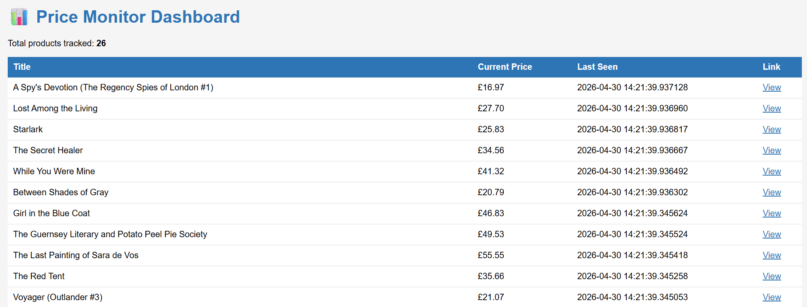
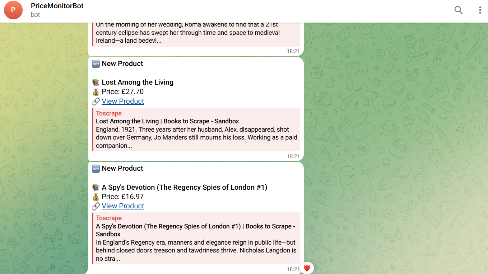

# Price Monitor 📊
> Built for e-commerce businesses and resellers who need to track competitor prices without manual checking.
Automated price monitoring system that tracks product prices and sends instant Telegram alerts when prices change or new products appear.

## What it does
- Scrapes product listings automatically every hour
- Detects price changes and new products
- Sends instant Telegram notifications for any changes
- REST API with public endpoints
- Dashboard to view all tracked products
- Deployed 24/7 on Railway

## Tech Stack
- Python
- FastAPI
- PostgreSQL
- Telegram Bot API
- Railway (deployment)
- cron-job.org (scheduling)

## Endpoints
| Endpoint | Description |
|----------|-------------|
| `/` | Health check |
| `/products` | Get all products as JSON |
| `/run` | Trigger scraper manually |
| `/dashboard` | View products in browser |

## Live Demo
Dashboard: https://price-monitor-89ll.onrender.com/dashboard
API: https://price-monitor-89ll.onrender.com/products

## Screenshots



## Alerts
- 🔥 Price dropped
- 📈 Price increased  
- 🆕 New product detected

## Setup
1. Clone the repo
2. Create `.env` with `BOT_TOKEN`, `CHAT_ID`, `DATABASE_PUBLIC_URL`
3. Install requirements: `pip install -r requirements.txt`
4. Run locally: `python main_runner.py`
5. Deploy to Railway and add PostgreSQL

## How it works
```
cron-job.org (every hour)
        ↓
FastAPI /run endpoint
        ↓
Scraper fetches all products
        ↓
Compare prices with PostgreSQL database
        ↓
Price changed or new product → Telegram alert
```
